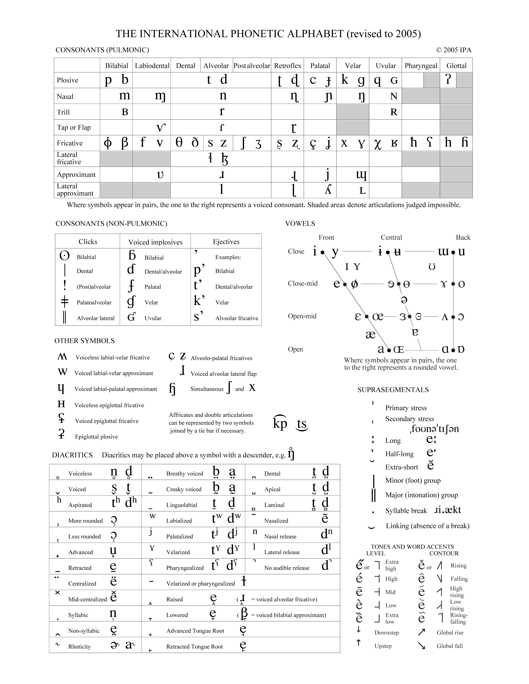

<h1>Building Blocks</h1>

  
  <iframe width="560" height="315" src="https://www.youtube.com/embed/80d2CEeMyQQ" title="YouTube video player" frameborder="0" allow="accelerometer; autoplay; clipboard-write; encrypted-media; gyroscope; picture-in-picture" allowfullscreen></iframe>
  

  
  
The IPA chart is a collection of all the human speech sounds known to linguists. It is one of the most valuable tools for a linguist to have,
  and understanding how it works is key to possessing a working knowledge of phonetics! The reason IPA (which stands for International Phonetic 
  Alphabet) is so important, is because it is universal across all languages. For example, take the letter 'w'. English speakers associate this symbol
  with the sound at the start of the words 'wig' and 'wand'. However certain other languages associate that symbol with the 'v' sound at the beginning
  of 'viola' or 'vent'. Due to this ambiguity, linguists did not previously have a way to communicate speech sounds in writing, as normal alphabet letters can be 
  pronounced differently. IPA has a unique symbol for every single sound known that humans can currently produce, according to phoneticians!

  <iframe src="https://h5p.org/h5p/embed/1232947" width="1090" height="551" frameborder="0" allowfullscreen="allowfullscreen" allow="geolocation *; microphone *; camera *; midi *;   encrypted-media *" title="Vowel Checker"></iframe>

  

  
  
  
<a href="https://commons.wikimedia.org/wiki/File:IPA2005_3000px.png">International Phonetic Association</a>, <a href="https://creativecommons.org/licenses/by-sa/3.0">CC BY-SA 3.0</a>, via Wikimedia Commons

  

