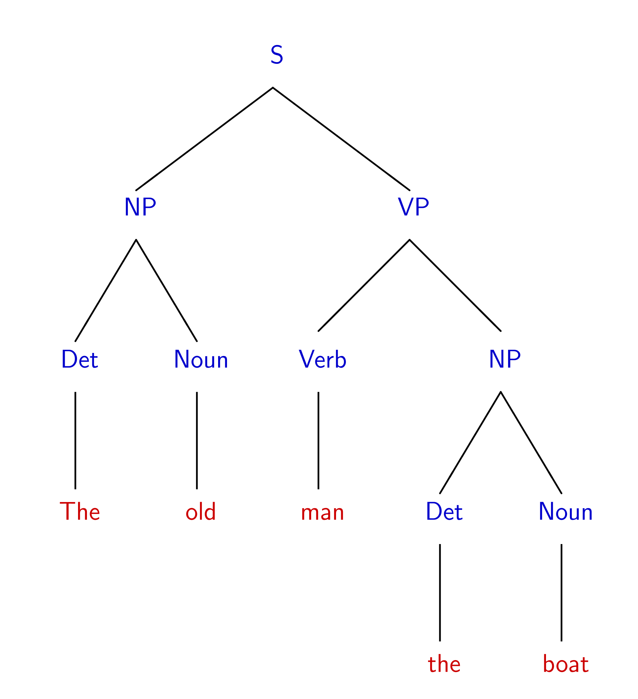

<h1 style="text-align:center;">Meaning</h1>

This page will introduce the fields of Morphology and Syntax!

  <a href="https://commons.wikimedia.org/wiki/File:Independently_morphology_tree.png">Annie yang</a>, <a href="https://creativecommons.org/licenses/by-sa/4.0">CC BY-SA 4.0</a>, via Wikimedia Commons

<h2 style="text-align:center;">Morphology</h2>
  

To the left is an image of a morphological tree! Throughout this section, we will explore what each part of this tree means, and what morphology is as a whole! Watch the youtube video below for a visual introduction!

  

  
  

  <iframe width="560" height="315" src="https://www.youtube.com/embed/93sK4jTGrss" title="YouTube video player" frameborder="0" allow="accelerometer; autoplay; clipboard-write; encrypted-media; gyroscope; picture-in-picture" allowfullscreen></iframe>
  

  

  
  
Morphology is the study of words and their component parts, known by linguists as 'morphemes'. It is instinctive to assume that only words are assigned meanings. However, upon closer analysis, we can see that it isn't just entire words that have meanings. For example, if I take a noun like 'plant' and add an '-s' to it (to create 'plants'), I have changed the meaning of the word and it has become a plural. From this, we can infer that '-s' carries a meaning. But we know through our knowledge of the English language that '-s' isn't a word! Therefore, there must be a language unit smaller than a word that still carries meaning, and this is what we call a morpheme.

  

  
There are multiple different types of morpheme, but the first distinction to make is between bound and free morphemes. Using the morphological tree to the left as an example, the morpheme 'depend' can stand on its own (note that, while this is a word, it also counts as a morpheme because it cannot be divided any further). However the morpheme '-ent' cannot stand on its own, and requires another morpheme to be attached to. The former is what linguists describe as a free morpheme, while the latter is bound. In most cases, the root (which is the morpheme that the word is built from, like '-depend-' in 'independent') is a free morpheme, while the affixes (morphemes that are attached to the root to create a new word) tend to be bound. However, this is not a hard and fast rule and you will come across some exceptions!

  

  
  

  
 
 
   
   
The second distinction to make between morphemes is whether they are inflectional or derivational. The website <a href="https://ielanguages.com/morphology.html" target="_blank">ielanguages.com</a> defines the difference between inflectional and derivational morphemes as being that "derivational affixes are added to morphemes to form new words that may or may not be the same part of speech and inflectional affixes are added to the end of an existing word for purely grammatical reasons." Below is a table from the same site detailing the 8 inflectional morphemes found in English.

  <table class="table table-striped table-bordered table-hover">
  <tbody>
    <tr>
      <td><strong>-s</strong></td>
      <td>3rd person singular present</td>
      <td>she waits</td>
    </tr>
    <tr>
      <td><strong>-ed</strong></td>
      <td>past tense</td>
      <td>he walked</td>
    </tr>
    <tr>
      <td><strong>-ing</strong></td>
      <td>progressive</td>
      <td>she's watching</td>
    </tr>
    <tr>
      <td><strong>-en</strong></td>
      <td>past participle</td>
      <td>she has eaten</td>
    </tr>
    <tr>
      <td><strong>-s</strong></td>
      <td>plural</td>
      <td>three tables</td>
    </tr>
    <tr>
      <td><strong>-'s</strong></td>
      <td>possessive</td>
      <td>Holly's cat</td>
    </tr>
    <tr>
      <td><strong>-er</strong></td>
      <td>comparative</td>
      <td>you are taller</td>
    </tr>
    <tr>
      <td><strong>-est</strong></td>
      <td>superlative</td>
      <td>you are the tallest</td>
    </tr>
  </tbody>
</table>
   
  

  
<iframe src="https://h5p.org/h5p/embed/1245475" width="1090" height="270" frameborder="0" allowfullscreen="allowfullscreen" allow="geolocation *; microphone *; camera *; midi *; encrypted-media *" title="Morphology Questions"></iframe>
  
  

  
Morphology is an enormous field with many different types of study, but the information above covers the basics. This topic will be touched upon more in the next page, as morphology occurs in all languages!

  

  

<h1>Syntax</h1>
  
  

  <iframe width="560" height="315" src="https://www.youtube.com/embed/tZTGglxxS7A" title="YouTube video player" frameborder="0" allow="accelerometer; autoplay; clipboard-write; encrypted-media; gyroscope; picture-in-picture" allowfullscreen></iframe>
  

  

Syntax moves further on from morphology, and examines how words are arranged into sentences (or 'utterances' in linguistic terms) to further affect meaning! You may be more aware of syntax than you think. Take a classic garden-path sentence for example.

    

The old man the boat.

    
The two images below show two different interpretations of this sentence, as it is <u>syntactically ambiguous</u>.

   
    <a href="https://commons.wikimedia.org/wiki/File:GardenPath1_svg.svg">Jochen Burghardt</a>, <a href="https://creativecommons.org/licenses/by-sa/4.0">CC BY-SA 4.0</a>, via Wikimedia Commons
    
    

  
    
    <a href="https://commons.wikimedia.org/wiki/File:GardenPath2_svg.svg">Jochen Burghardt</a>, <a href="https://creativecommons.org/licenses/by-sa/4.0">CC BY-SA 4.0</a>, via Wikimedia Commons
   
    

<ul class="pagination justify-content-center" style="margin:20px 0">
  <li class="page-item"><a class="page-link" href="https://skinnydini.github.io/SML5202-2021-Final/page2.html">Previous</a></li>
  <li class="page-item"><a class="page-link" href="https://skinnydini.github.io/SML5202-2021-Final/">1</a></li>
  <li class="page-item"><a class="page-link" href="https://skinnydini.github.io/SML5202-2021-Final/page2.html">2</a></li>
  <li class="page-item active"><a class="page-link" href="https://skinnydini.github.io/SML5202-2021-Final/page3.html">3</a></li>
  <li class="page-item"><a class="page-link" href="https://skinnydini.github.io/SML5202-2021-Final/page4.html">4</a></li>
  <li class="page-item"><a class="page-link" href="https://skinnydini.github.io/SML5202-2021-Final/page5.html">5</a></li>
  <li class="page-item"><a class="page-link" href="https://skinnydini.github.io/SML5202-2021-Final/page4.html">Next</a></li>
</ul>
