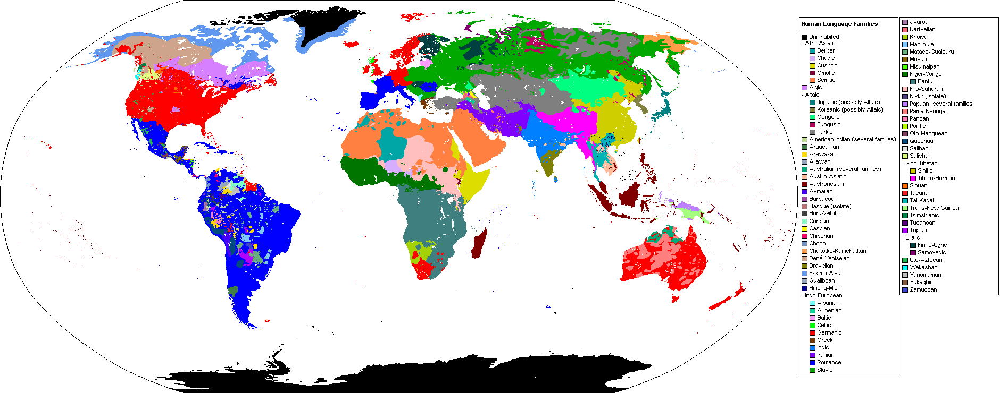

<h1 style="text-align:center;">Languages</h1>

<a href="https://commons.wikimedia.org/wiki/File:Human_Language_Families_Map.PNG">Industrius at English Wikipedia.Later version(s) were uploaded by Mttll at English Wikipedia.</a>, <a href="http://creativecommons.org/licenses/by-sa/3.0/">CC BY-SA 3.0</a>, via Wikimedia Commons

As evident from the map pictured above, English is not the only lanuage on the planet. In fact, there are roughly 6,5000 languages alive and being spoken as of current! Linguistics aims to study and explore all of human languages, and not just one or two. In order to do this, we must apply our knowledge of linguistics (phonetics, morphology, syntax, and so on) to other world languages! 

Most people are aware that languages other than their own contain different speech sounds. For example, the Spanish language contains a voiced alveolar trill (refer back to the Building Blocks page to figure out which sound this is!) whereas the English language doesn't. However, other languages also have different morphemes and syntax!

One of the main ways linguists accomplish this is through a process called <strong><u>glossing</u></strong>, or more specifically interlinear glossing. An example of this is shown below:

<pre>German (cf. 9)

unser-nVäter-n
our-DAT.PLfather.PL-DAT.PL
'to our fathers' (cf. singular Vater)</pre>

<ul class="pagination justify-content-center" style="margin:20px 0">
  <li class="page-item"><a class="page-link" href="https://skinnydini.github.io/SML5202-2021-Final/page3.html">Previous</a></li>
  <li class="page-item"><a class="page-link" href="https://skinnydini.github.io/SML5202-2021-Final/">1</a></li>
  <li class="page-item"><a class="page-link" href="https://skinnydini.github.io/SML5202-2021-Final/page2.html">2</a></li>
  <li class="page-item"><a class="page-link" href="https://skinnydini.github.io/SML5202-2021-Final/page3.html">3</a></li>
  <li class="page-item active"><a class="page-link" href="https://skinnydini.github.io/SML5202-2021-Final/page4.html">4</a></li>
  <li class="page-item"><a class="page-link" href="https://skinnydini.github.io/SML5202-2021-Final/page5.html">5</a></li>
  <li class="page-item"><a class="page-link" href="https://skinnydini.github.io/SML5202-2021-Final/page5.html">Next</a></li>
</ul>
