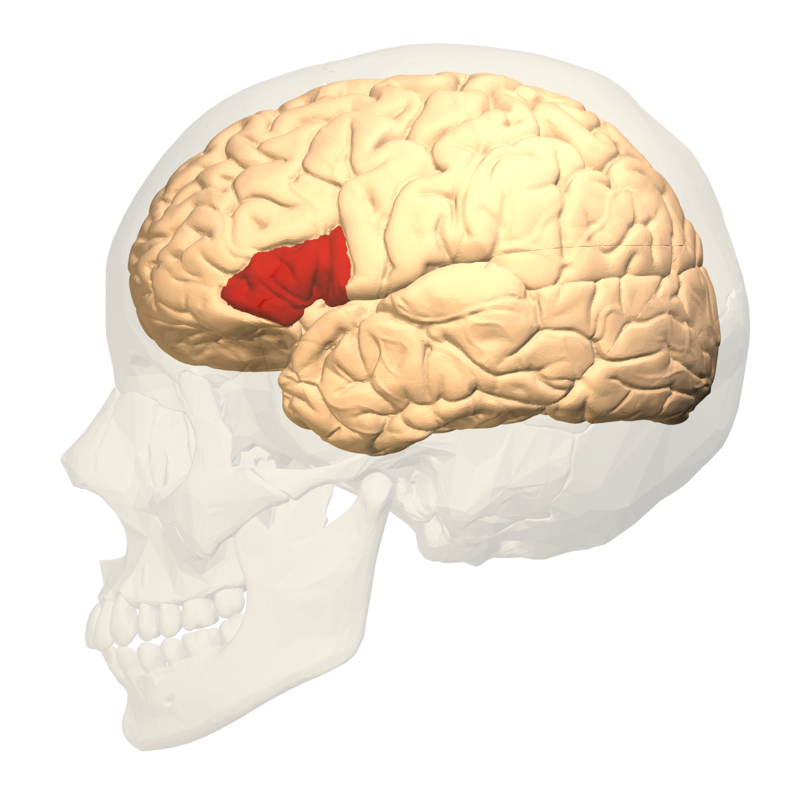
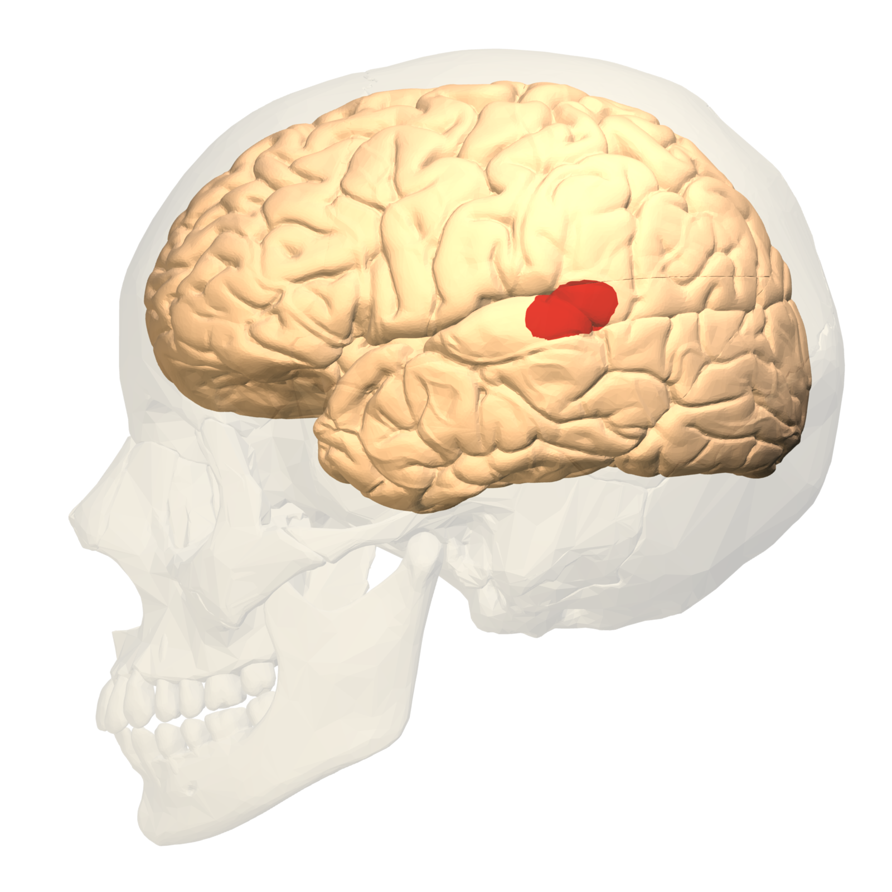

<h1 style="text-align:center;">The Mind and More</h1>

Moving beyond just studying language, linguistics research crosses heavily over into fields like neuroscience and psychology. In order to illustrate this, linguists often refer to the medical conditions known as aphasia. Aphasia is a condition in which physiological damage occurs to the brain and, as a result, language capacity is impaired. See the quote below from <a href="https://www.healthline.com/health/brocas-aphasia#:~:text=Broca's%20aphasia%20is%20a%20non,speech%20and%20for%20motor%20movement.">healthline.com</a> on Broca's aphasia:

  Broca’s aphasia results from damage to a part of the brain called Broca’s area, which is located in the frontal lobe,
  usually on the left side. It’s one of the parts of the brain responsible for speech and for motor movement. It’s named
  for Pierre Paul Broca, a French physician who discovered the area in 1861. Broca’s aphasia is also referred to as expressive aphasia.
  </pre>
  
  
and Wernicke's aphasia:

  
  <pre>
  Wernicke’s aphasia is the most common type of fluent aphasia. It occurs when the left middle side of the brain becomes
  damaged or altered. This part of the brain is known as Wernicke’s area, named after Carl Wernicke, a neurologist. Wernicke’s
  area of the brain controls human language. It’s also near where we store our personal dictionaries. Someone with
  Wernicke’s aphasia may have difficulty processing the meaning of spoken words.
  </pre>
  

  
  

  
  

  
  

  
  

  
  

<iframe src="https://h5p.org/h5p/embed/1246316" width="545" height="762" frameborder="0" allowfullscreen="allowfullscreen" allow="geolocation *; microphone *; camera *; midi *; encrypted-media *" title="Find Multiple Hotspots"></iframe>
  
  

  
  
As displayed on this website, linguistics is a huge and relatively new field, and there are plenty of areas to get involved with. The six main fields of study are as follows:

  
  <ul>
  <li>Phonetics</li>
  <li>Phonology</li>
  <li>Morphology</li>
  <li>Syntax</li>
  <li>Semantics</li>
  <li>Pragmatics</li>
</ul>

  
but broader areas of study include:

  
 <ul>
   <li>Computational Linguistics</li>
   <li>Forensic Linguistics</li>
   <li>Neurolinguistics</li>
   <li>Psycholinguistics</li>
   <li>and more!!</li>
  </ul>
  
  
The following links offer careers advice for linguistics:

  
   <ul>
   <li><a href="https://www.qmul.ac.uk/careers/media/careers/downloads/Careers-After-a-Languages-or-Linguistics-Degree.pdf">qmul.ac.uk</a></li>
   <li><a href="https://www.ucl.ac.uk/pals/research/linguistics/study-linguistics/linguistics-careers">ucl.ac.uk</a></li>
   <li><a https://www.prospects.ac.uk/careers-advice/what-can-i-do-with-my-degree/linguistics">prospects.ac.uk</a></li>  
  </ul>

  

  
<ul class="pagination justify-content-center" style="margin:20px 0">
  <li class="page-item"><a class="page-link" href="https://skinnydini.github.io/SML5202-2021-Final/page4.html">Previous</a></li>
  <li class="page-item"><a class="page-link" href="https://skinnydini.github.io/SML5202-2021-Final/">1</a></li>
  <li class="page-item"><a class="page-link" href="https://skinnydini.github.io/SML5202-2021-Final/page2.html">2</a></li>
  <li class="page-item"><a class="page-link" href="https://skinnydini.github.io/SML5202-2021-Final/page3.html">3</a></li>
  <li class="page-item"><a class="page-link" href="https://skinnydini.github.io/SML5202-2021-Final/page4.html">4</a></li>
  <li class="page-item active"><a class="page-link" href="https://skinnydini.github.io/SML5202-2021-Final/page5.html">5</a></li>
  <li class="page-item disabled"><a class="page-link" href="#">Next</a></li>
</ul>
